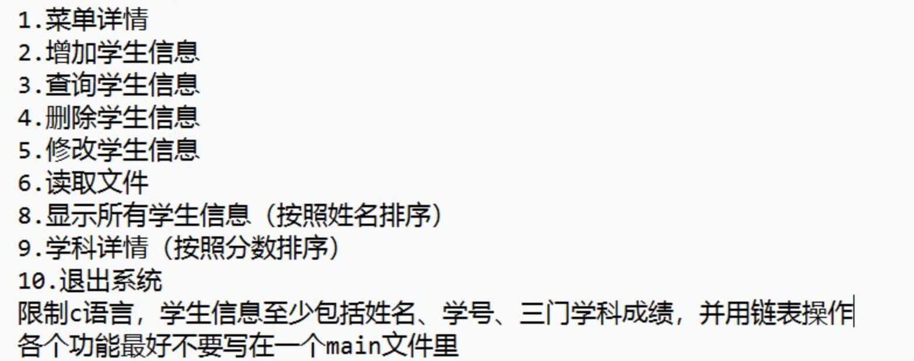

# 第三周学习任务（2024-11-04 ~ 2024-11-10）
## 任务介绍
- **描述**: 继续自主学习链表，包括但不限于单链表、循环链表、双向链表、链表的反转、链表的合并、链表的排序等
- **截止日期**: 2024-11-10
- **状态**: 已截至
- **检查方式**: 不检查
- **备注**: 可以去学习一下用数组模拟链表操作的实现

## 任务介绍
- **描述**: 注册一个技术论坛账号，以后可以把学习笔记发布在博客上，帮助别人，帮助自己找回学习轨迹，享受做笔记的乐趣
- **截止日期**: 2024-11-10
- **状态**: 进行中
- **检查方式**: 暂不检查
- **备注**: 比如CSDN，稀土掘金等

## 任务介绍
- **描述**: 自己找5道算法题完成，并且提交到学长学姐检查
- **截止日期**: 2024-11-10
- **状态**: 已截至
- **检查方式**: 检查
- **备注**: 以后如果是让大家自己找题做，则其实是希望大家自由学习算法知识点，比如滑动窗口，kmp，dfs等

## 任务介绍
- **描述**: 利用链表和C语言的文件读写实现学生管理系统
- **截止日期**: 2024-11-17 (两周)
- **状态**: 进行中
- **检查方式**: 以第一次开会的形式进行检查，顺便总结一下大家近期的学习情况
- **要求**: 提交一个C语言的源代码文件，要求实现学生管理系统，包括数据的持久化和可视化(txt,excel)，数据结构要求手搓链表，下面是详细要求：
-  
  
- **备注**: 到时候需要大家现场展示，可能会有老老东西观看，还是希望大家认真完成