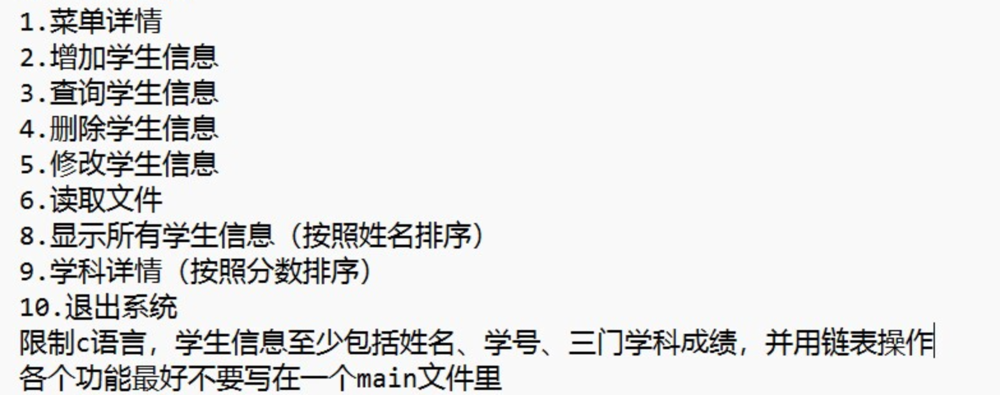

# 第四周学习任务（2024-11-11 ~ 2024-11-17）
## 任务介绍
- **描述**: 利用链表和C语言的文件读写实现学生管理系统
- **截止日期**: 2024-11-17
- **状态**: 已结束
- **检查方式**: 以第一次开会的形式进行检查，顺便总结一下大家近期的学习情况
- **要求**: 提交一个C语言的源代码文件，要求实现学生管理系统，包括数据的持久化和可视化(txt,excel)，数据结构要求手搓链表，下面是详细要求：
-  
  
- **备注**: 到时候需要大家现场展示，可能会有老老东西观看，还是希望大家认真完成

- ## 任务介绍
- **描述**: 自主学习栈与队列
- **截止日期**: 2024-11-17
- **状态**: 已结束
- **检查方式**: 不检查
- **要求**: 要能做到用C语言模拟实现栈与队列的数据结构，并且能用C语言实现栈与队列的基本操作，若学习了C++等高级语言，可以尝试熟练使用STL中的栈与队列或者其他语言的容器。

- ## 任务介绍
- **描述**: 自主找5道算法题完成
- **截止日期**: 2024-11-17
- **状态**: 已结束
- **检查方式**: 检查
- **要求**: 5道题目中至少包含一个栈相关题目，一个队列题目，且不要5道都是Leetcode函数题。

- ## 任务介绍
- **描述**: 完成《虚动家人の大学思考》
- **截止日期**: 2024-12-01
- **状态**: 进行中
- **检查方式**: 检查
- **要求**: 一定要非常仔细的完成填写，事关我们未来的学习安排，也可以趁这个机会思考一下自己未来要选择的方向，队员们可相互讨论，尽量不要都选择同一方向。